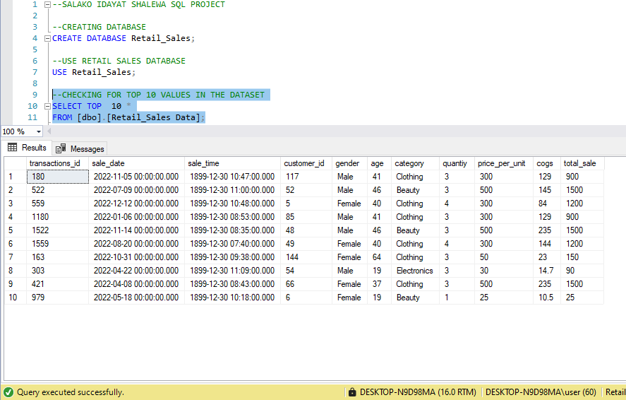
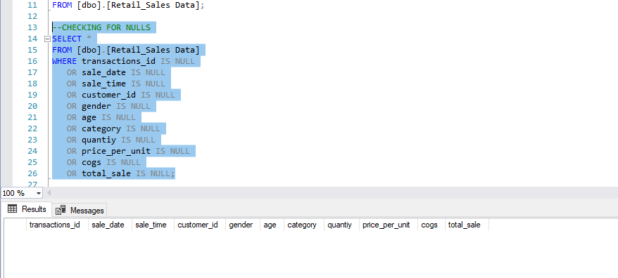
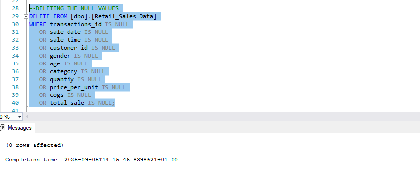
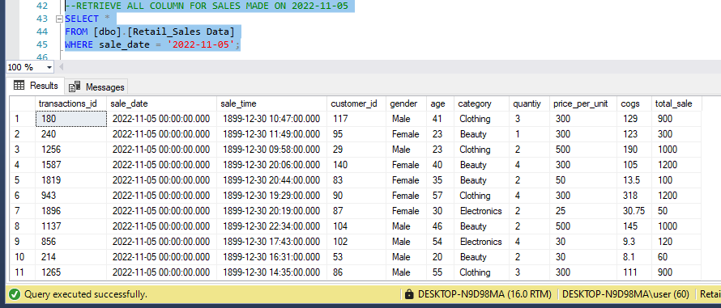

#  SQL Sales Analysis  

This project The project involves setting up a retail sales database, 
performing exploratory data analysis (EDA), and answering specific 
business questions through SQL queries by analyzing the sales data and uncover insights about revenue trends, customer behavior, and product performance.  

---

## Project Overview
- Created a new database and imported the given data.
- Wrote SQL queries to explore and clean sales data.  
- Analyzed **monthly sales performance, top customers, and product trends**.  
- Created queries for different business use-cases like **shift-based sales, variance analysis, and revenue growth**.  

---

## Tools & Skills  
- **SQL Server Management Studio (SSMS)**  
- Joins, Subqueries, Aggregate Functions  
- GROUP BY, ORDER BY, HAVING Clauses  
- Window Functions  

---

## Dashboard / Query Output Preview  
  
 
 
 

---

## Sample Queries  

### Top 5 Customers by Total Sales  
```sql
SELECT TOP 5 CustomerID, SUM(TotalSale) AS TotalRevenue
FROM Sales
GROUP BY CustomerID
ORDER BY TotalRevenue DESC;


2. Monthly Average Sales
SELECT YEAR(OrderDate) AS Year, MONTH(OrderDate) AS Month,
       AVG(TotalSale) AS AvgMonthlySale
FROM Sales
GROUP BY YEAR(OrderDate), MONTH(OrderDate)
ORDER BY Year, Month;


3. Sales by Shift (Morning, Afternoon, Evening)
SELECT 
    CASE 
        WHEN DATEPART(HOUR, OrderDate) < 12 THEN 'Morning'
        WHEN DATEPART(HOUR, OrderDate) BETWEEN 12 AND 17 THEN 'Afternoon'
        ELSE 'Evening'
    END AS Shift,
    COUNT(OrderID) AS TotalOrders
FROM Sales
GROUP BY 
    CASE 
        WHEN DATEPART(HOUR, OrderDate) < 12 THEN 'Morning'
        WHEN DATEPART(HOUR, OrderDate) BETWEEN 12 AND 17 THEN 'Afternoon'
        ELSE 'Evening'
    END;


4. Variance & Standard Deviation of Revenue and Quantity
SELECT 
    VAR(TotalSale) AS RevenueVariance,
    STDEV(TotalSale) AS RevenueStdDev,
    VAR(Quantity) AS QuantityVariance,
    STDEV(Quantity) AS QuantityStdDev
FROM Sales;


 ### Key Insights

 Top 5 customers contributed 35%+ of total revenue.

 November & December recorded the highest average revenue.

 Manager performance varied significantly, highlighting areas for targeted improvement.

 Morning sales were the most frequent, but evening sales had the highest average revenue per order.


## Files in This Repo

sales_queries.sql → SQL queries used in analysis

SQL_Project_Report.pdf → Detailed project report

sql-results.png → Screenshot of query results


